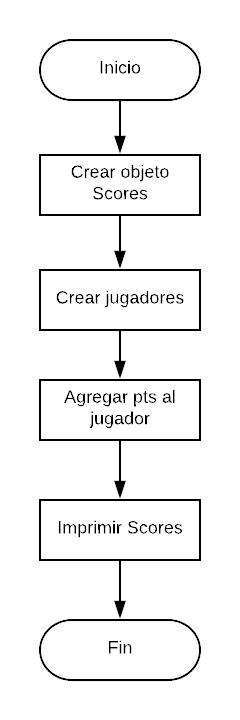

  # SCOREKEEPER

  ### Descripción:

Imagina que estás jugando un juego con algunas amigas y quieres ir registrando el puntaje de cada una. Crea un object llamado scores donde los keys o propiedades son los nombres de tus amigas, y los valores serán los puntajes (todos empiezan con 0).

Escribe una función que toma dos argumentos, el nombre de tu amiga y la cantidad de puntos nuevos que ha obtenido, y que actualice los puntos de la jugadora en el object scores. También escribe una función que imprima en la consola el total de los puntos.

## Pseudocódigo
### Descripción:
En esta parte se describe la funcionalidad del proyecto descrito en pasos.

1. Definir  el objeto scores en el cual se almacenará toda la data.

2. Crear los elementos JUGADORES que se almacenarán como *keys* en el objeto SCORES.

3. Agregar el puntaje de cada jugador.

4. Imprimir toda la data que se encuentra almacenada en el objeto _SCORES_.

## Diagrama de Flujo

### Descripción

bla bla bla

